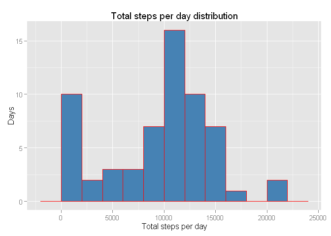
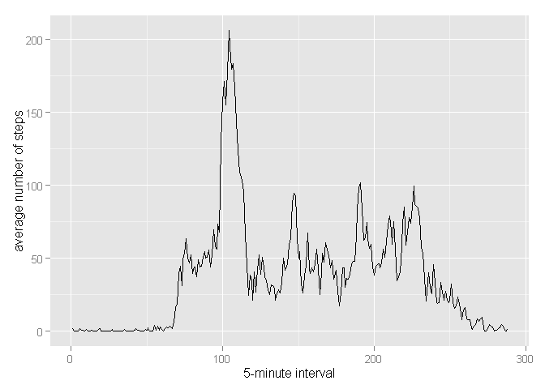
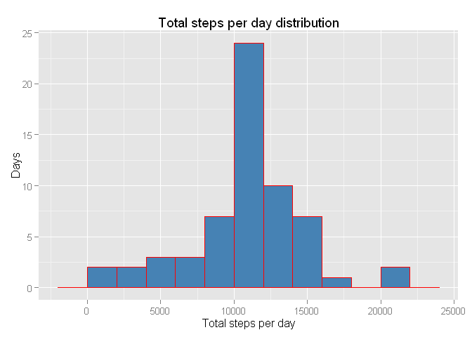
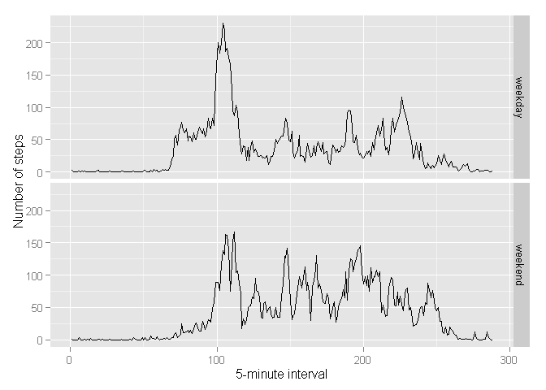

# Reproducible Research: Peer Assessment 1
## Initial settings


```r
# Set locale
Sys.setlocale("LC_TIME", "English")
```

```
## [1] "English_United States.1252"
```

```r
# Load ggplot2
library("ggplot2")
# Turn off scientific notations for numbers
options(scipen = 1)  
```

## Loading and preprocessing the data

Since the initial zip file is in the ropository do not download it. Just unzip and read csv file into data frame dataSet. Add a new factor variable in the dataset with two levels – “weekday” and “weekend” indicating whether a given date is a weekday or weekend day.

```r
unzip(zipfile="activity.zip")
dataSet <- read.csv("activity.csv")

getDay <- function(date) 
{
  day <- weekdays(date)
  if (day %in% c("Monday", "Tuesday", "Wednesday", "Thursday", "Friday"))
    return("weekday")
  else if (day %in% c("Saturday", "Sunday"))
    return("weekend")
  else
    stop("invalid date")
}
 
dataSet$date <- as.Date(dataSet$date)
dataSet$day <- sapply(dataSet$date, FUN=getDay)
```

## What is mean total number of steps taken per day?

For this part of the assignment, the missing values in the dataset can be ignored.

Calculate the total number of steps taken per day.

```r
totalSteps <- tapply(X=dataSet$steps, INDEX=dataSet$date, FUN=sum, na.rm=T)
```

### 1. Make a histogram of the total number of steps taken each day.

```r
qplot(totalSteps, binwidth=2000, geom="histogram")+
    geom_bar(stat="bin", binwidth=2000, colour = "red", fill = "steelblue", width = 0.7) + 
    labs(title = "Total steps per day distribution", x = "Total steps per day", y = "Days")
```

 

###2. Calculate and report the mean and median of the total number of steps taken per day

```r
totalStepsMean <- mean(totalSteps, na.rm=T)
totalStepsMedian <- median(totalSteps, na.rm=T)
```
The mean is 9354.2295082 and the median is 10395.

## What is the average daily activity pattern?

Calculate average steps per interval.

```r
averageStepsPerInterval <- aggregate(x=list(steps=dataSet$steps), 
                                     by=list(interval=dataSet$interval), 
                                     FUN=mean, 
                                     na.rm=T)
```
### 1. Make a time series plot (i.e. type = "l") of the 5-minute interval (x-axis) and the average number of steps taken, averaged across all days (y-axis)

```r
ggplot(data = averageStepsPerInterval, aes(x = 1:length(steps), y = steps)) + 
  geom_line() + 
  xlab("5-minute interval") + ylab("average number of steps")
```

 
    
### 2. Which 5-minute interval, on average across all the days in the dataset, contains the maximum number of steps?

```r
maxStepsInterval <- which.max(averageStepsPerInterval$steps)
timeMaxStepsInterval <-  gsub("([0-9]{1,2})([0-9]{2})", "\\1:\\2", 
                              averageStepsPerInterval[maxStepsInterval,'interval'])
```

24-hour day is splitted into 288 5-minute intervals. The 104th 5-minute interval contains the maximum number of steps. The corresponding time is 8:35.

## Imputing missing values

### 1. Calculate and report the total number of missing values in the dataset (i.e. the total number of rows with NAs)

```r
rowsWithNA <- sum(is.na(dataSet))
```

The total number of rows with NAs is 2304.

### 2. Devise a strategy for filling in all of the missing values in the dataset. The strategy does not need to be sophisticated. For example, you could use the mean/median for that day, or the mean for that 5-minute interval, etc.

Missing value for the interval is substituted with the rounded mean value for the same interval.

### 3. Create a new dataset that is equal to the original dataset but with the missing data filled in.


```r
dataSetNoNA <- dataSet 
for (i in 1:nrow(dataSetNoNA)) 
{
  if (is.na(dataSetNoNA$steps[i])) 
  {
    dataSetNoNA$steps[i] <- round(averageStepsPerInterval[which(averageStepsPerInterval$interval == dataSetNoNA$interval[i]), ]$steps)
  }
}

head(dataSetNoNA)
```

```
##   steps       date interval     day
## 1     2 2012-10-01        0 weekday
## 2     0 2012-10-01        5 weekday
## 3     0 2012-10-01       10 weekday
## 4     0 2012-10-01       15 weekday
## 5     0 2012-10-01       20 weekday
## 6     2 2012-10-01       25 weekday
```
### 4. Make a histogram of the total number of steps taken each day and Calculate and report the mean and median total number of steps taken per day. Do these values differ from the estimates from the first part of the assignment? What is the impact of imputing missing data on the estimates of the total daily number of steps?

```r
totalStepsNoNA <- tapply(X=dataSetNoNA$steps, INDEX=dataSetNoNA$date, FUN=sum)

qplot(totalStepsNoNA, binwidth=2000, geom="histogram")+
    geom_bar(stat="bin", binwidth=2000, colour = "red", fill = "steelblue", width = 0.7) + 
    labs(title = "Total steps per day distribution", x = "Total steps per day", y = "Days")
```

 

```r
totalStepsNoNAMean <- mean(totalStepsNoNA)
totalStepsNoNAMedian <- median(totalStepsNoNA)
```
For the data set with substituted missing values mean is 10765.6393443 and the median is 10762. For the initial one mean is 9354.2295082 and the median is 10395. 

Thus mean and median values are higher after imputing missing data. The reason is that in the original data, there are some days with steps values NA for any interval. Theses observations are not taken into account in total mumber of steps calculations. 

## Are there differences in activity patterns between weekdays and weekends?

Make a panel plot containing a time series plot (i.e. type = "l") of the 5-minute interval (x-axis) and the average number of steps taken, averaged across all weekday days or weekend days (y-axis). See the README file in the GitHub repository to see an example of what this plot should look like using simulated data.

```r
averages <- aggregate(steps ~ interval + day, data = dataSetNoNA, mean)

ggplot(averages, aes(c(1:(length(steps)/2),1:(length(steps)/2)), steps)) + geom_line() + facet_grid(day ~ .) + 
    xlab("5-minute interval") + ylab("Number of steps")
```

 
